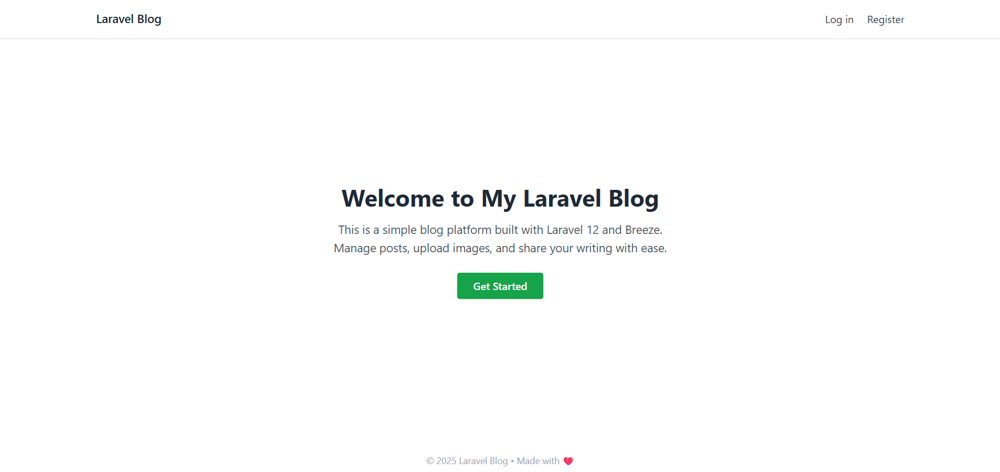
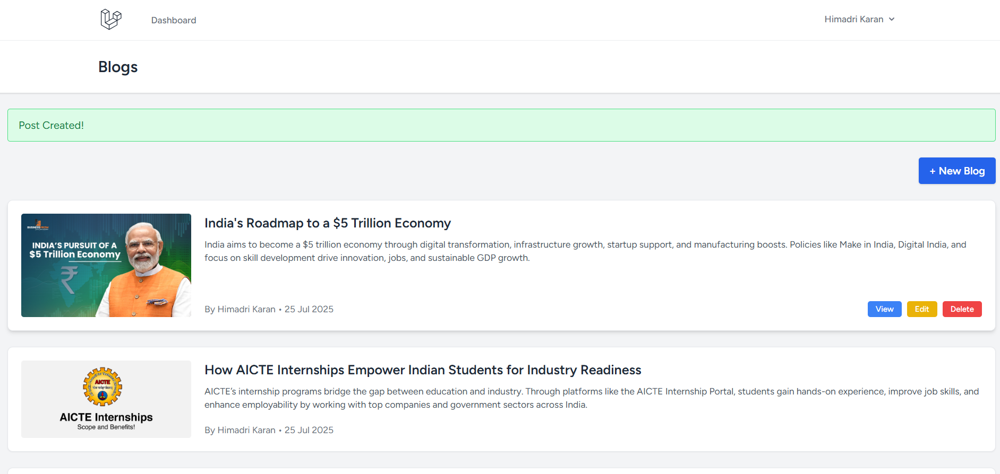
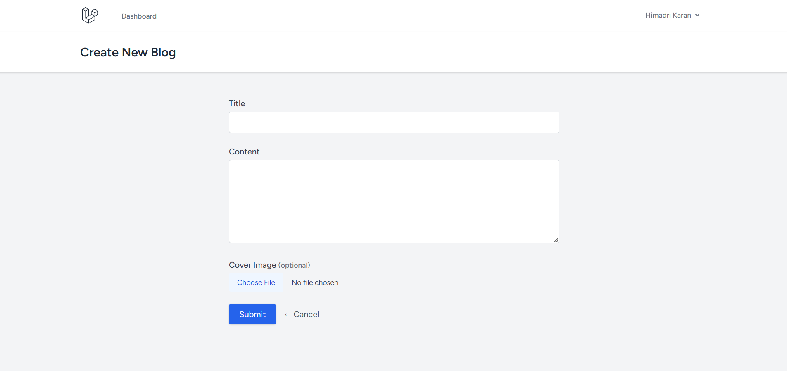
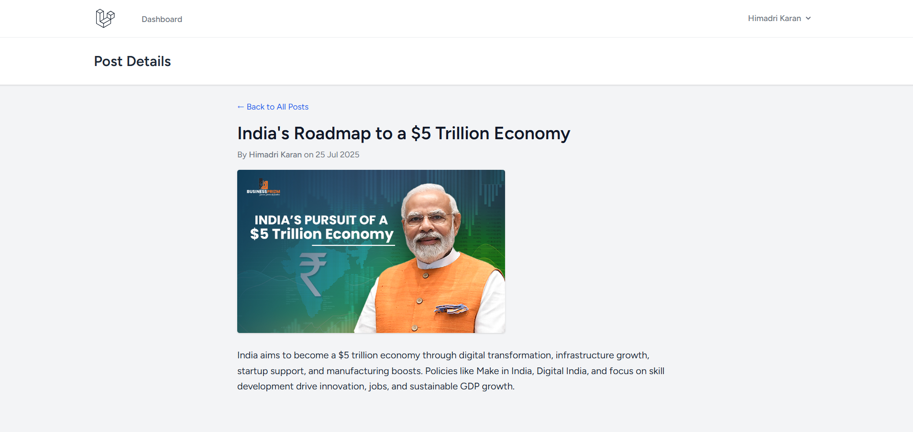

# 📝 Laravel Blog Application

This is a simple full-stack blog web app built using **Laravel 12**. It includes user authentication, CRUD functionality for blog posts, image upload, and uses Tailwind CSS via Vite.

---

## 🚀 Features

- ✅ User registration & login (Laravel Breeze)
- 📝 Create, read, update, delete blog posts
- 🖼 Cover image upload support
- 🗃️ Sqlite database integration
- 🎨 Tailwind CSS styling
- 🧠 Laravel route model binding
- 🔐 Auth-protected routes
- 📁 Clean folder structure with Blade components

---

## 🧑‍💻 Tech Stack

- **Framework:** Laravel 12 (with Breeze)
- **Database:** sqlite
- **Frontend:** Blade + Tailwind CSS
- **Auth:** Laravel Breeze (with session)
- **Dev Tools:** Composer, Vite, Node.js, NPM

---

## ⚙️ Installation & Setup

1. **Clone the repo** or download the ZIP:

   ```bash
   git clone https://github.com/your-username/blog-app.git
   cd blog-app
   ```

2. **Install dependencies**

   ```bash
   composer install
   npm install
   ```

3. **Create .env file**

   ```bash
   cp .env.example .env
   ```

4. **Set your DB config in .env:**

   ```makefile
   DB_CONNECTION=mysql
   DB_HOST=127.0.0.1
   DB_PORT=3306
   DB_DATABASE=blog_app
   DB_USERNAME=root
   DB_PASSWORD=
   ```

5. **Generate app key**

   ```bash
   php artisan key:generate
   ```

6. **Run migrations**

   ```bash
   php artisan migrate
   ```

7. **Link storage (for image uploads)**

   ```bash
   php artisan storage:link
   ```

8. **Start the dev server**

   ```bash
   npm run dev
   php artisan serve
   ```

9. **Visit:**
   👉 http://127.0.0.1:8000

---

## ✨ Screenshots


*User Registration/Login*


*Blog posts listing page*


*Create new blog post form*


*Individual blog post view*

---

## 👤 Sample User Credentials (if needed)
You can register a new user from the UI directly. No seeding required.

---

## 📁 Folder Structure
```
resources/views/posts/
├── index.blade.php
├── create.blade.php
├── edit.blade.php
└── show.blade.php
```

---

## 🙌 Acknowledgments
- [Laravel Official Docs](https://laravel.com/docs)
- [Laravel Breeze](https://laravel.com/docs/starter-kits#laravel-breeze) for auth scaffolding
- [Tailwind CSS](https://tailwindcss.com/)

---

## 🧑 Author
**Himadri Karan**
- 🔗 [LinkedIn](https://linkedin.com/in/himadrikaran)
- 💻 [Portfolio](https://himadri.me)
- 🐱 [GitHub](https://github.com/karanhimadri)
